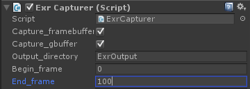
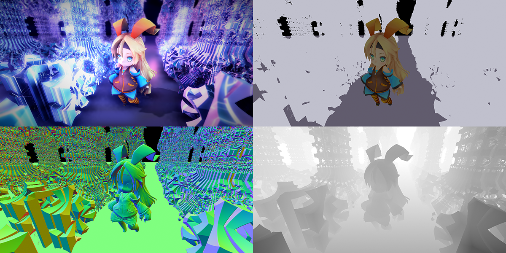

# FrameCapturer
[English](https://translate.google.com/translate?sl=ja&tl=en&u=https://github.com/unity3d-jp/FrameCapturer/) (by Google Translate)

フレームバッファの内容をキャプチャして画像や動画に出力する Unity 用のプラグインです。アニメ gif, mp4, exr, png への出力に対応しています。現在は Windows 専用となっています。(ソースレベルでは Mac や Linux でもビルドできて動くはずですが、未確認です)  

使用するにはまずこのパッケージをプロジェクトにインポートしてください: [FrameCapturer.unitypackage](https://github.com/unity3d-jp/FrameCapturer/blob/master/Packages/FrameCapturer.unitypackage?raw=true)  
以下は各コンポーネントの説明になります。
- [Gif Recorder](#gif-recorder)
- [MP4 Recorder](#mp4-recorder)
- [Exr Recorder](#exr-recorder)
- [Png Recorder](#png-recorder)

## Gif Recorder
ゲーム画面をキャプチャしてアニメ gif としてエクスポートします。
常時録画して後で面白いカットを切り出してファイルに出力する、というような使い方を想定しています。  
録画解像度はかなり小さめ (横 300 pixel 程度) を推奨しています。
現状 gif のエンコードはとても遅い上、解像度に比例してすごい勢いで負荷が上がっていくため、等倍解像度の録画をリアルタイムで行うのは絶望的です。

以下のような機能を備えています。
- 直近 N フレームをメモリに残し、後で指定部分だけをファイルに出力 (=ShadowPlay や PS4 と似た録画方法)
- 非同期＆並列エンコーディング (メインスレッドをブロックしない)
- 簡単な in-game プレビューア＆エディタ
- D3D9, D3D11, OpenGL と x86, x86-64 の組み合わせに対応 (ただし Windows でのみ動作を確認)
- 録画結果をゲーム内から直接 Twitter へ投稿可能

以下の動画を見ると何ができるのか大体わかると思います。  
  

以下はこのプラグインで出力されたアニメ gif の例です。  
  

### 使い方
1. 録画したいカメラに GifRecorder コンポーネントを追加
2. uGUI オブジェクト MovieRecorderUI.prefab をどこかに配置し、それの capturer に 2 で追加したコンポーネントを設定

2 は必須ではありませんが、GifRecorder には録画の on/off 切り替えやファイルへの書き出しなどをコントロールするための GUI やスクリプトが必要になります。
MovieRecorderUI.prefab は機能はともかく見た目は必要最小限のため、これを使う場合も独自に改良した方がいいでしょう。

Twitter への投稿機能は、[TweetMedia](https://github.com/unity3d-jp/TweetMedia) によって実現されています。詳しくはそちらをご参照ください。  
TweetScreenshot.prefab はこちらのパッケージにしかない prefab で、録画した gif を添付する機能が追加された Tweet 用 GUI になっています。

## MP4 Recorder
ゲーム画面をキャプチャして mp4 動画で出力します。

動画のエンコーダ (OpenH264) はパッケージには含んでおらず、実行時にダウンロードして展開するようになっています。
ダウンロード＆展開は通常すぐ終わるはずですが、ダウンロードが終わっていない場合や、何らかの事情で失敗した場合は録画できない状態になってしまいます。  
パッケージに含めていないのにはライセンス的な理由があります。
MP4 の使用には通常ライセンス料が課せられます。しかし、OpenH264 は特定の条件を満たしていればこのライセンス料を免除できるようになっています。その条件は以下のようなものです。

1. OpenH264 のバイナリはソフトウェア本体とは別にダウンロードするようになっている
2. ユーザーは OpenH264 を使用するか否かをコントロールできるようになっている
3. OpenH264 の使用をコントロールする場所に次の一文を明記してある: "OpenH264 Video Codec provided by Cisco Systems, Inc."
4. これらの条件のライセンスの条文 ( http://www.openh264.org/BINARY_LICENSE.txt 下部) が参照可能になっている

(より正確には原文の方を参照ください: http://www.openh264.org/faq.html)  
OpenH264 を使ったゲームをリリースしたい場合も、上記条件を満たさないとライセンス料を課せられる可能性が生じるため、このような仕様にしています。

## Exr Recorder  
Exr は主に映像業界で使われる画像フォーマットで、float や half のピクセルデータで構成された画像、いわゆる HDR 画像を保持できます。  
GifRecorder や MP4Recorder と違い、ExrRecorder および PngRecorder は映像制作用途を想定したものになっています。
具体的には、G-Buffer やマテリアル ID などを書き出し、コンポジットに使う、といった使い方です。現状 G-Buffer の書き出しと任意の RenderTexture の書き出しに対応しています。  
Exr エクスポートは非常に重く、リアルタイムで行うのは厳しい処理であるため、デルタタイムを固定して事前に指定しておいた範囲のフレームを書き出す、という使い方を想定しています。  
(パッケージに付属の UTJ/Misc/FixDeltaTime はデルタタイムの固定を行うユーティリティになっています)

### 使い方

#### G-Buffer & フレームバッファのキャプチャ (ExrRecorder)
1. 録画したいカメラに ExrRecorder コンポーネントを追加
2. キャプチャしたい要素 (G-Buffer, FrameBuffer)、キャプチャ開始 / 終了フレームを設定し、Play  

  

Depth_format は、depth を 16 bit で書き出す場合 Half、32 bit で書き出す場合 Float を指定します。
depth は元データが 24 bit のため Float が望ましいのですが、編集ソフトが対応していない場合などに Half で書き出す必要性が生じます。

出力例:  
    
  

ファイル構成やレイヤー名の変更などを行いたい場合、ExrRecorder.cs の OnPostRender() 内のエクスポート部分を書き換えることで対応可能です。

---

#### RenderTexture のキャプチャ (ExrOffscreenRecorder)
1. 録画したいカメラに ExrOffscreenCapturer コンポーネントを追加
2. RenderTexture を用意し、カメラと ExrOffscreenCapturer に設定
3. キャプチャ開始 / 終了フレームを設定し、Play

大体 ExrRecorder と同じです。
ExrOffscreenCapturer の Targets には複数の RenderTexture を設定可能で、ここで設定したものの内容を .exr として書き出します。

## Png Recorder
ゲーム画面を連番 PNG でキャプチャします。  
こちらも想定している用途は映像のコンポジット用で、使い方もほぼ ExrRecorder と同じです。
指定したフレーム間の G-Buffer やフレームバッファの各要素を連番 png で書き出します。
任意の RenderTexture をキャプチャする PngOffscreenRecorder が用意されているのも同様です。

png は 16 bit 整数のカラーをサポートしており、half や float の RenderTexture は 16 bit モードで書き出します。
16 bit 整数カラーの場合、1.0 以上のカラーは 256 以上になる、という挙動になります。
つまり **0.0 - 1.0 の範囲しか扱わない場合は 8 bit カラーと変わらないので注意が必要です**。

コンポジット用途としては exr の方が望ましいと思われますが、exr の読み込みの遅さから png の方が好まれるケースもあるそうで、png も用意しています。

## Thanks
- gif エクスポートに Jon Olick 氏の GIF Writer に手を加えたものを使用しています。オリジナルからの主な変更点は、出力先をファイルからメモリに変えたことです。  
  - オリジナル: http://www.jonolick.com/home/gif-writer  
  - fork: https://github.com/unity3d-jp/FrameCapturer/blob/master/Plugin/external/jo_gif.cpp
- mp4 エクスポートに以下のライブラリ群を使用しています。
  - OpenH264 http://www.openh264.org/
  - libyuv https://code.google.com/p/libyuv/
  - FAAC http://www.audiocoding.com/faac.html  
  - libcurl (OpenH264 ダウンローダに使用) http://curl.haxx.se/libcurl/
  - bzip2 (OpenH264 ダウンローダに使用) http://www.bzip.org/
- exr エクスポート以下のライブラリ群を使用しています。
  - OpenEXR http://www.openexr.com/  
  - zlib http://www.zlib.net/  
- png エクスポート以下のライブラリ群を使用しています。
  - libpng http://www.libpng.org/pub/png/libpng.html
- Twitter への投稿に TweetMedia を使用しています。  
  - https://github.com/unity3d-jp/TweetMedia

## License
MIT License:

  Copyright (C) 2015 Unity Technologies Japan, G.K.

  Permission is hereby granted, free of charge, to any person obtaining a copy of this software and associated documentation files (the "Software"), to deal in the Software without restriction, including without limitation the rights to use, copy, modify, merge, publish, distribute, sublicense, and/or sell copies of the Software, and to permit persons to whom the Software is furnished to do so, subject to the following conditions: The above copyright notice and this permission notice shall be included in all copies or substantial portions of the Software.

  THE SOFTWARE IS PROVIDED "AS IS", WITHOUT WARRANTY OF ANY KIND, EXPRESS OR IMPLIED, INCLUDING BUT NOT LIMITED TO THE WARRANTIES OF MERCHANTABILITY, FITNESS FOR A PARTICULAR PURPOSE AND NONINFRINGEMENT. IN NO EVENT SHALL THE AUTHORS OR COPYRIGHT HOLDERS BE LIABLE FOR ANY CLAIM, DAMAGES OR OTHER LIABILITY, WHETHER IN AN ACTION OF CONTRACT, TORT OR OTHERWISE, ARISING FROM, OUT OF OR IN CONNECTION WITH THE SOFTWARE OR THE USE OR OTHER DEALINGS IN THE SOFTWARE.
