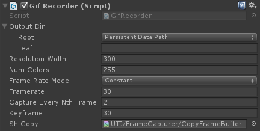
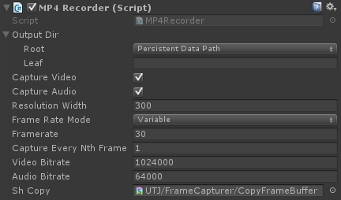
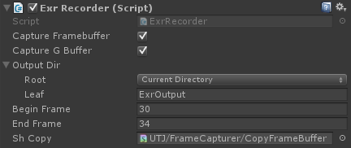
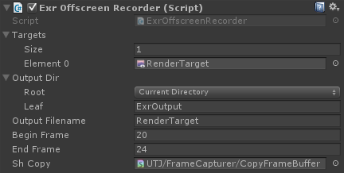
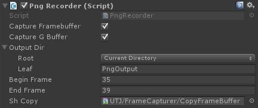

# FrameCapturer
[English](https://translate.google.com/translate?sl=ja&tl=en&u=https://github.com/unity3d-jp/FrameCapturer/) (by Google Translate)

フレームバッファの内容をキャプチャして画像や動画に出力する Unity 用のプラグインです。gif, mp4, exr, png への出力に対応しています。動作環境は Unity 5.2 以上で、OpenGL, D3D9, D3D11 環境下で動作します。現状 Windows  専用です (32bit, 64bit 両対応)。ソースレベルでは Mac や Linux でもビルドできて動くはずですが、未確認です。

使用するにはまずこのパッケージをプロジェクトにインポートしてください: [FrameCapturer.unitypackage](https://github.com/unity3d-jp/FrameCapturer/blob/master/Packages/FrameCapturer.unitypackage?raw=true)  
以下は各コンポーネントの説明になります。
- [Gif Recorder](#gif-recorder)
- [MP4 Recorder](#mp4-recorder)
- [Exr Recorder](#exr-recorder)
- [Png Recorder](#png-recorder)

その他、履歴や補足情報など。
- [C++ Interface](#c-interface)
- [History](#history)
- [Thanks](#thanks)
- [License](#license)

---

## Gif Recorder
ゲーム画面をキャプチャしてアニメ gif としてエクスポートします。
常時録画して後で面白いカットを切り出してファイルに出力する、というような使い方を想定しています。  
以下のような機能を備えています。
- 直近 N フレームをメモリに残し、後で指定部分だけをファイルに出力 (=ShadowPlay や PS4 と似た録画方法)
- 非同期＆並列エンコーディング (メインスレッドをブロックしない)
- 簡単な in-game プレビューア＆エディタ
- 録画結果をゲーム内から直接 Twitter へ投稿可能

録画解像度はかなり小さめ (横 300 pixel 程度) を推奨しています。
gif のエンコードはとても遅い上、解像度に比例してすごい勢いで負荷が上がっていくため、等倍解像度の録画をリアルタイムで行うのは絶望的です。(後述の mp4 の録画よりも数倍遅いです！)

以下の動画を見ると何ができるのか大体わかると思います。  
  
以下はこのプラグインで出力されたアニメ gif の例です。  
  

### 使い方
1. 録画したいカメラに GifRecorder コンポーネントを追加
2. uGUI オブジェクト MovieRecorderUI.prefab をどこかに配置し、それの capturer に 2 で追加したコンポーネントを設定

2 は必須ではありませんが、GifRecorder には録画の on/off 切り替えやファイルへの書き出しなどをコントロールするための GUI やスクリプトが必要になります。
MovieRecorderUI.prefab は機能はともかく見た目は必要最小限のため、これを使う場合も独自に改良した方がいいでしょう。

- Frame Rate Mode  
  Constant だとフレームレートを一定 (Framerate) に保ちます。Variable だとゲーム内のデルタ時間が録画結果にも反映されます。  
  これは処理落ちなどでフレームレートが低下したときの挙動に影響します。Variable だと処理落ちに応じて gif もコマ落ちすることになり、結果ゲーム時間と再生時間は同期します。Constant だと gif 側のフレームレートは一定に保たれるため、結果処理落ちすると gif の再生時間はゲームよりも速くなります。
- Framerate  
  Frame Rate Mode が Constant の時、gif のフレームレートはこの数値に保たれます。Variable の時は無視されます。
- Capture Every Nth Frame  
  1 だと全フレーム録画、2 だと 2 フレームに一回録画します。60 FPS のゲームで 30 FPS の録画を行いたい時 2 に設定します。

RenderTexture の録画を行う GifOffscreenRecorder というのも用意されています。Target にRenderTexture を指定する以外は使い方は GifRecorder と同じです。

録画した gif をゲーム内から直接 Twitter へ投稿することもできます。
Twitter 投稿機能は、[TweetMedia](https://github.com/unity3d-jp/TweetMedia) によって実現されており、詳しくはそちらをご参照ください。  
TweetScreenshot.prefab はこちらのパッケージにしかない prefab で、録画した gif を添付する機能が追加された Tweet 用 GUI になっています。

注意すべき点として、Gif はフレーム間のデルタ時間は単位がセンチ秒 (10ms) になっています。このため再生のフレームレートは 100FPS, 50FPS, 33FPS, 25FPS... となってしまい、60FPS を正確に表現することができなくなっています。(実際のところ大抵のソフトウェアは 100FPS ではなく 60FPS だったり 30FPS だったりで再生するようですが)

---

## MP4 Recorder
ゲーム画面をキャプチャして mp4 動画で出力します。

- Frame Rate Mode  
- Framerate  
- Capture Every Nth Frame  
  これら 3 つは Gif Recorder での説明がそのまま当てはまりますが、mp4 の場合重要な注意事項があります。録音もする場合、Frame Rate Mode は Variable にすべきということです。  
  Constant だとだんだん音と映像がズレていきます。これは Constant だとゲーム時間と再生時間の同期を諦めてフレームレートを一定に保つためです。

動画のエンコーダ (OpenH264) はパッケージには含んでおらず、実行時にダウンロードして展開するようになっています。
ダウンロード＆展開は通常すぐ終わるはずですが、ダウンロードが終わっていない時や何らかの事情で失敗した場合など、録画が失敗するケースがありうる、ということは気に留めておいた方がいいと思われます。  
パッケージに含めていないのにはライセンス的な理由があります。
MP4 の使用には通常ライセンス料が課せられる可能性が生じます。しかし、OpenH264 は特定の条件を満たしていればこのライセンス料を免除できるようになっています。その条件は以下のようなものです。

1. OpenH264 のバイナリはソフトウェア本体とは別にダウンロードするようになっている
2. ユーザーは OpenH264 を使用するか否かをコントロールできるようになっている
3. OpenH264 の使用をコントロールする場所に次の一文を明記してある: "OpenH264 Video Codec provided by Cisco Systems, Inc."
4. これらの条件のライセンスの条文 ( http://www.openh264.org/BINARY_LICENSE.txt 下部) が参照可能になっている

(より正確には原文の方を参照ください: http://www.openh264.org/faq.html)  
OpenH264 を使ったゲームをリリースしたい場合も、上記条件を満たさないとライセンス料を課せられる可能性が生じるため、このような仕様にしています。

---

## Exr Recorder  
Exr は主に映像業界で使われる画像フォーマットで、float や half のピクセルデータで構成された画像、いわゆる HDR 画像を保持できます。  
GifRecorder や MP4Recorder と違い、ExrRecorder および PngRecorder は映像制作用途を想定したものになっています。
具体的には、G-Buffer やマテリアル ID などを書き出し、コンポジットに使う、といった使い方です。  
Exr のエクスポートは非常に遅く、リアルタイムで行うのは困難であるため、デルタタイムを固定して事前に指定しておいた範囲のフレームを書き出す、という使い方を前提としています。
パッケージにはデルタタイムを固定する簡単なスクリプトが付属しています。(UTJ / Misc / FixDeltaTime)

###### G-Buffer & フレームバッファのキャプチャ (ExrRecorder)
1. 録画したいカメラに ExrRecorder コンポーネントを追加
2. キャプチャしたい要素 (G-Buffer, FrameBuffer)、キャプチャ開始 / 終了フレームを設定
3. Play

プレイ開始後、指定フレームの範囲に来ると自動的に指定ディレクトリへエクスポートします。
ファイル構成やレイヤー名は現状決め打ちになっています。
変更したい場合、ExrRecorder.cs の DoExport() 内のエクスポート部分を書き換えることで対応可能です。

出力例:  

###### RenderTexture のキャプチャ (ExrOffscreenRecorder)
RenderTexture の内容をキャプチャするバージョンです。
1. 録画したいカメラに ExrOffscreenCapturer コンポーネントを追加
2. キャプチャしたい RenderTexture を Targets に設定
3. キャプチャ開始 / 終了フレームなどを設定
4. Play

大体 ExrRecorder と同じで、Targets に指定した RenderTexture の内容が .exr に書き出されるようになっています。
Target は複数指定可能です。

---

## Png Recorder
ゲーム画面を連番 PNG でキャプチャします。  
EXR と同様、こちらも想定している用途は映像のコンポジットです。
使い方も ExrRecorder, ExrOffscreenRecorder と全く同じで、指定したフレーム間の G-Buffer やフレームバッファの各要素を連番 png で書き出せるようになっています。

png は 16 bit 整数カラーをサポートしており、half や float の RenderTexture は 16 bit モードで書き出します。
16 bit 整数カラーの場合、0.0 - 1.0 -> 0 - 255 の変換ルールはそのまま、1.0 より大きな色が 256 以上になる、という挙動になります。
つまり **0.0 - 1.0 の範囲しか扱わない場合、出力される情報量は 8 bit カラーと同等になります**。ご注意ください。  
以上のことからコンポジット用途としては exr の方が望ましいのですが、exr はインポート/エクスポートが遅く、png で精度が足りる場合はそちらが使われるケースもあるそうで、PngRecorder も用意されています。

 

---

## C++ Interface
本プラグインは、画面のキャプチャから各種ファイルへのエクスポートはネイティブコードの DLL として実装されています。この DLL は Unity への依存はなく、非 Unity のアプリケーションへも容易に組み込めるようになっています。使い方は [テストコード](Plugin/Tests) と [FrameCapturer.h](Plugin/FrameCapturer.h) を読むと大体わかると思います。  
ソースからビルドすればスタティックリンクライブラリを作ることもできます。ビルドの手順は、このリポジトリを pull して setup.bat を実行した後、Plugin/FrameCapturer.sln をビルドするだけです。MasterLib がスタティックリンクライブラリをビルドする設定になっています。

## History
- 2016/03/10
  - MP4 Recorder
  - PNG Recorder
  - GL Core モードをサポート
  - これまで未対応だったファイルフォーマットとカラーフォーマットの組み合わせをサポート  
    - ファイルフォーマットがサポートしていないカラーフォーマットも変換を挟むことでエクスポートできるようにした
    - gif や mp4 の場合 16/32bit カラーは 8bit カラーに変換してエンコード、exr の場合 8bit カラーは 16bit カラーに変換してエクスポート、など
  - C++ インターフェースの整備
- 2016/01/07
  - MP4 Recorder (beta)
- 2015/06/10
  - Twitter 投稿機能
- 2015/06/05
  - Exr Recorder
- 2015/06/01
  - Gif Recorder

## Todo
  - MP4: 使える環境ではハードウェアエンコーダを使う
    -  GeForce の 600 系以降などを使用時にエンコードの大幅な高速化が見込める
  - MP4: RTMP ストリーミング対応
    - Twitch など各種配信サイトへの対応

## Thanks
- gif エクスポートに Jon Olick 氏の GIF Writer に手を加えたものを使用しています。オリジナルからの主な変更点は、出力先をファイルからメモリに変えたことです。  
  - オリジナル: http://www.jonolick.com/home/gif-writer  
  - fork: https://github.com/unity3d-jp/FrameCapturer/blob/master/Plugin/external/jo_gif.cpp
- mp4 エクスポートに以下のライブラリ群を使用しています。
  - OpenH264 http://www.openh264.org/
  - libyuv https://code.google.com/p/libyuv/
  - FAAC http://www.audiocoding.com/faac.html  
  - libcurl (OpenH264 ダウンローダに使用) http://curl.haxx.se/libcurl/
  - bzip2 (OpenH264 ダウンローダに使用) http://www.bzip.org/
- exr エクスポート以下のライブラリ群を使用しています。
  - OpenEXR http://www.openexr.com/  
  - zlib http://www.zlib.net/  
- png エクスポート以下のライブラリ群を使用しています。
  - libpng http://www.libpng.org/pub/png/libpng.html
- Twitter への投稿に TweetMedia を使用しています。  
  - https://github.com/unity3d-jp/TweetMedia
- Intel ISPC を用いて一部の処理を高速化しています
  - http://ispc.github.io/

## License
MIT License:

  Copyright (C) 2015-2016 Unity Technologies Japan, G.K.

  Permission is hereby granted, free of charge, to any person obtaining a copy of this software and associated documentation files (the "Software"), to deal in the Software without restriction, including without limitation the rights to use, copy, modify, merge, publish, distribute, sublicense, and/or sell copies of the Software, and to permit persons to whom the Software is furnished to do so, subject to the following conditions: The above copyright notice and this permission notice shall be included in all copies or substantial portions of the Software.

  THE SOFTWARE IS PROVIDED "AS IS", WITHOUT WARRANTY OF ANY KIND, EXPRESS OR IMPLIED, INCLUDING BUT NOT LIMITED TO THE WARRANTIES OF MERCHANTABILITY, FITNESS FOR A PARTICULAR PURPOSE AND NONINFRINGEMENT. IN NO EVENT SHALL THE AUTHORS OR COPYRIGHT HOLDERS BE LIABLE FOR ANY CLAIM, DAMAGES OR OTHER LIABILITY, WHETHER IN AN ACTION OF CONTRACT, TORT OR OTHERWISE, ARISING FROM, OUT OF OR IN CONNECTION WITH THE SOFTWARE OR THE USE OR OTHER DEALINGS IN THE SOFTWARE.
